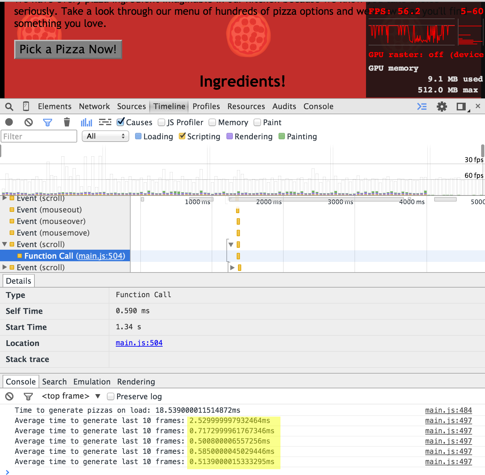

#Mike Cone's - Project 4
Website Optimization


--
### My Project Location
* [My Github Pages:](http://mrmikeesc99.github.io/Udacity-Project-4/)
* [My Github Repo:](https://github.com/mrmikeeSC99/Udacity-Project-4)

--
###Changes I made:

####Part 1 - Optimizing index.html

Installed Grunt and Grunt Plugins to minify css, js, and html.

Google Optimized files

* images/pizzeria.jpg
* images/profilepic.jpg

Moved analytic js to bottom of page AND added async.

Inlined script perfmatters.js

Used javascript to delay load of style.css until document ready.

Converted profile pic to BASE64 data instead separate file.

--
####Part 2.1 - Framerate improvement

Moved offending calcuation out of for loop so calculation only needed to be run once instead of every iteration of the for loop.

```js
      var items = document.querySelectorAll('.mover');
      var scrllTp = (document.body.scrollTop / 1250);
      for (var i = 0; i < items.length; i++) {
        var phase = Math.sin(scrllTp + (i % 5));
        items[i].style.left = items[i].basicLeft + 100 * phase + 'px';
      }
```

--
####Part 2.2 Calc Speed less than 5ms

2.2.1 created cache variable for DOM lookup


```js
      // Iterates through pizza elements on the page and changes their widths
      function changePizzaSizes(size) {
        // cache querySelctorALL method as rdmPizzaCntr to only call method once - Mike Cone
        var rdmPizzaCntr = document.querySelectorAll(".randomPizzaContainer");
        for (var i = 0; i < rdmPizzaCntr.length; i++) {
          var dx = determineDx(rdmPizzaCntr[i], size);
          var newwidth = (rdmPizzaCntr[i].offsetWidth + dx) + 'px';
          rdmPizzaCntr[i].style.width = newwidth;
        }
      }
```

2.2.2 moved pizzasDiv var lookup outside of loop to only call it once.


```js
    // This for-loop actually creates and appends all of the pizzas when the page loads
    // moved pizzasDiv var lookup outside of loop to only call it once. Mike Cone 2.2.2
    var pizzasDiv = document.getElementById("randomPizzas");
    for (var i = 2; i < 100; i++) {
      pizzasDiv.appendChild(pizzaElementGenerator(i));
    }
```


--
#Results

This results in pizza reloads of 2.5ms and 0.5ms on scrolling.


